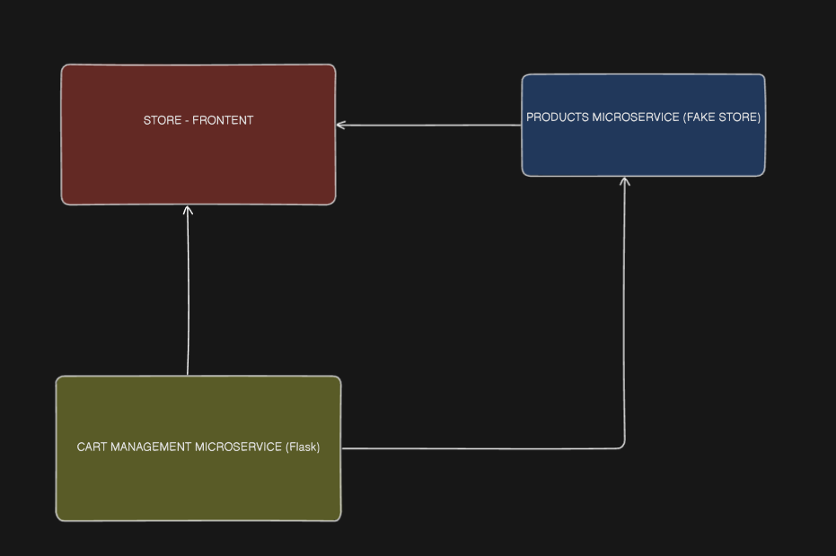

# Software Architecture MVP - Frontend Application

## Overview
This repository contains the frontend component of a microservices-based application developed as part of the Software Architecture post-graduation course. The project demonstrates the implementation of modern architectural patterns and best practices in distributed systems.

## Project Description
The frontend application serves as the user interface for our microservices ecosystem, providing a seamless and responsive experience for users while interacting with various backend services.

## Running

### Docker

It's possible to run the *vite preview* using make (`make run`) or the *vite development* (`make dev`).
Development serves the application with each change made, while preview uses a production build that needs to be rebuilt on each new change applied.

*_It's also possible to run without make._*
- Vite Preview
    - `docker build -t puc-arq-soft-front .` 
    - `docker run --rm -p 4173:4173 puc-arq-soft-front`
    - Now your Docker should be running and exposing port 4173 for preview
- Vite Development
    - `docker compose up --build --watch` 
    - Now your Docker should be running and exposing port 4173 for development work

### Locally

- Prerequisites
    - Node.js (LTS recommended version - as of today this is 22.140)
    - npm or yarn package manager

1. Clone the repository
2. Run `npm install` or `yarn install` to install dependencies
3. Run `npm run preview` or `yarn preview` to preview the application

## Architecture Overview

This app follows a microservice architecture where it communicates with the product service (fake store) and the cart service (the flask api that manages cart). 
The intent was to create a fully functional service but didn´t had time to finish. 

## System Architecture Diagram Overview

