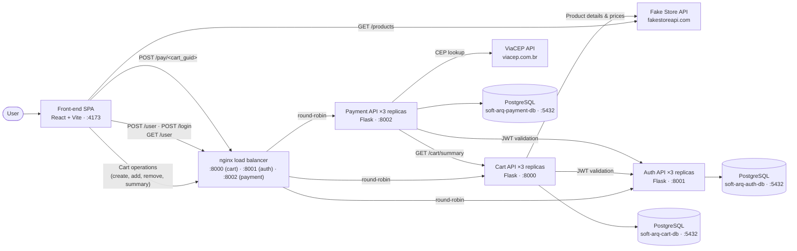

# Software Architecture MVP — Front-end Application

Online shopping single-page application developed for the Software Architecture
post-graduation course (PUC). It renders the store catalog and manages the shopping
cart, fetching product data directly from the external
[Fake Store API](https://fakestoreapi.com/), delegating cart operations to the
back-end cart API and authentication to the back-end auth API — all back-end
APIs live in the
[back-end repository](https://github.com/ommeirelles/puc-arq-soft-cart), which
also includes the payment API that finalizes the purchase at checkout.

## Stack

- **React 19** + **TypeScript** + **Vite 6**
- **Tailwind CSS 4** + **daisyUI** for styling
- **Zod** for runtime schema validation (API responses and forms)
- **React Hook Form** (with `@hookform/resolvers`) for form state and validation

## Architecture Overview

This app is the front-end of a microservice-based system. It communicates with the
product service (Fake Store API) for catalog data, with the cart service (the
Flask back-end) for everything cart-related, with the auth service (the
Flask back-end) for user registration and authentication, and with the payment
service (the Flask back-end) to finalize the purchase at checkout.

```mermaid
flowchart LR
    User([User]) --> FE["Front-end SPA<br/>React + Vite · :4173"]
    FE -->|"GET /products"| FSA["Fake Store API<br/>fakestoreapi.com"]
    FE -->|"Cart operations<br/>(create, add, remove, summary)"| LB["nginx load balancer<br/>:8000 (cart) · :8001 (auth) · :8002 (payment)"]
    FE -->|"POST /user · POST /login<br/>GET /user"| LB
    FE -->|"POST /pay/&lt;cart_guid&gt;"| LB
    LB -->|"round-robin"| BE["Cart API ×3 replicas<br/>Flask · :8000"]
    LB -->|"round-robin"| AUTH["Auth API ×3 replicas<br/>Flask · :8001"]
    LB -->|"round-robin"| PAY["Payment API ×3 replicas<br/>Flask · :8002"]
    BE -->|"Product details & prices"| FSA
    BE -->|"JWT validation"| AUTH
    PAY -->|"JWT validation"| AUTH
    PAY -->|"GET /cart/summary"| BE
    PAY -->|"CEP lookup"| VIA["ViaCEP API<br/>viacep.com.br"]
    BE --> DB[("PostgreSQL<br/>soft-arq-cart-db · :5432")]
    AUTH --> AUTHDB[("PostgreSQL<br/>soft-arq-auth-db · :5432")]
    PAY --> PAYDB[("PostgreSQL<br/>soft-arq-payment-db · :5432")]
```

> **Design choice — horizontal scaling:** each back-end service runs **3
> replicas** (`deploy.replicas` in the compose file) behind an **nginx load
> balancer** (`soft-arq-lb`, config in [`./nginx/nginx.conf`](./nginx/nginx.conf))
> that round-robins requests across the replicas. The load balancer publishes
> the same host ports the services used to expose (`8000` for cart, `8001` for
> auth, `8002` for payment), so this app needs no configuration change. This
> works because the services are stateless: sessions are self-signed JWTs and
> carts are identified by GUID, so any replica can serve any request.

> **Design choice — one database per service:** each back-end service owns a
> dedicated PostgreSQL container (`soft-arq-cart-db` for the cart API,
> `soft-arq-auth-db` for the auth API, `soft-arq-payment-db` for the payment
> API), so services can be scaled horizontally
> and independently without sharing a database. The APIs connect through the
> `DB_URL` environment variable (set by the compose file); when `DB_URL` is not
> set they fall back to a local SQLite file, which keeps the standalone
> `make run` / `make dev` flows working without extra infrastructure.

Key implementation points:

- Routing is handled by `react-router`: the login page is the index route (`/`),
  user registration lives at `/register`, the store catalog lives at `/store`,
  the product details page lives at `/store/product/:id`, and the checkout
  lives at `/checkout` (with the confirmation at `/checkout/success`) — the
  store, product and checkout routes are guarded by `RequireAuth`. When no
  token is present in `sessionStorage` (key
  `auth_token`), the guard clears the session (token and cart GUID) and redirects
  to the login page. Every route is lazy-loaded (`React.lazy` + `Suspense` with
  a full-screen loading fallback), so each page ships as its own chunk and is
  only fetched when first navigated to.
- Clicking a product card in the catalog (image, text, or title link) navigates
  to the product details page (`src/pages/product/index.tsx`), which fetches
  the product from `GET /products/{id}` and displays all of its information:
  image, title, category, id, rating (read-only star rating plus rate and
  review count), full description and price, alongside the same quantity +
  "Buy Now" add-to-cart form used in the catalog cards. The page shows a
  skeleton while loading and a "Product not found" state (with a link back to
  the store) when the product does not exist. The breadcrumbs link back to the
  catalog: `Store` goes to `/store`, and the category goes to
  `/store?category=<name>`, which opens the catalog with only that category
  selected in the filter panel. The header is reused without the
  search input (which only filters the catalog listing), and the logo links
  back to `/store`.
- The checkout page (`src/pages/checkout/index.tsx`, route `/checkout`)
  finalizes the cart through the payment API: it shows an order summary (items
  with image, quantity and subtotal, plus the total) next to a payment form
  (card number, expiry and CVV, validated with Zod — the expiry must be a
  future date) and a delivery address form. Typing a valid 8-digit CEP
  auto-fills the street, neighborhood, city and state from the ViaCEP API
  (the fields stay editable). Submitting calls `POST /pay/<cart_guid>`: when
  the payment is approved the cart GUID is removed from `localStorage` and the
  app navigates to the confirmation page (`src/pages/checkout/success.tsx`,
  route `/checkout/success`), a stub that informs the order is ready and will
  be shipped to the address provided; when the payment is declined a warning
  is shown and the cart is kept so the user can try again. An empty cart
  renders an empty state with a link back to the store.
- Authentication is **JWT-based**: the auth API issues a signed token on login,
  stored in `sessionStorage` under the key `auth_token`. Logout is client-side —
  the token is simply discarded.
- The active cart is **session-less**: its GUID is created by the back-end and
  persisted in `localStorage` under the key `cart_guid`.
- The header includes a search input (before the cart basket) that filters the
  product listing as you type: the text is matched case-insensitively against
  the product title and description first; only when that yields no results does
  it fall back to matching the image URL and category. On mobile the header
  stacks in two rows: the Fake Store APP logo centered on top, and the search
  input plus cart basket below (the logout button is hidden — logout lives in
  the mobile dock), and the cart dropdown adapts to the viewport width. When
  the cart has items, the dropdown ends with a "Finalize purchase" button that
  navigates to the checkout. Product
  images use native lazy loading (`loading="lazy"`) so they only load when they
  enter the viewport.
- The store catalog can be filtered by category through a side panel
  (`src/pages/store/components/category-filter.tsx`): each category is a checkbox
  that includes/removes its products from the listing, plus a button to
  select/unselect all categories at once. Filtering happens entirely
  on the front-end — no extra requests are made. When no products are left to
  display (e.g., all categories unselected), an empty state
  (`src/pages/store/components/empty-state.tsx`) informs that no products are
  available. The panel is responsive: on
  desktop (`lg` and up) it renders side by side with the product grid and can be
  collapsed to a slim strip; on smaller screens it becomes an overlay drawer
  opened from the mobile dock (daisyUI `drawer` with `lg:drawer-open`).
- On mobile, a daisyUI `dock` (`src/components/mobile-dock.tsx`, hidden at `lg`
  and up) sticks to the bottom of the store page with three actions: **Logout**,
  **Top** (smooth-scrolls the product grid to the top) and **Filters** (opens the
  category drawer).
- The product listing is a fluid CSS grid
  (`grid-cols-[repeat(auto-fill,minmax(220px,1fr))]`): cards have a 220px minimum
  width (in line with common e-commerce grids like Amazon, Mercado Livre and
  Best Buy), stretch evenly to fill the row, and the grid adds a column whenever
  another minimum-width card fits — 4 columns at 1440px, 3 at 820px.
- Service layer in `src/services/`:
  - `api.ts` — abstract HTTP client (`get`/`post`/`put`/`patch`/`delete`) with
    optional Zod response validation.
  - `product.ts` — `ProductService`, a singleton that fetches products from the
    Fake Store API and caches them in memory by ID.
  - `cart.ts` — `CartService`, a singleton that creates/retrieves the cart,
    fetches the cart summary (items grouped by product, with quantities), and
    adds/removes items through the back-end API. Every request carries the
    `Authorization: Bearer` JWT; on `401` the session and cart are cleared and
    the app redirects to the login page, and on a `400` "Cart not found"
    response (stale/invalid GUID) the cart is discarded and the operation is
    retried once with a freshly created cart.
  - `auth.ts` — `AuthService`, a singleton that registers users and authenticates
    through the back-end auth API, storing the returned JWT in `sessionStorage`.
  - `payment.ts` — `PaymentService`, a singleton that pays a cart through the
    back-end payment API (`POST /pay/<cart_guid>`), returning the registered
    payment (card brand + last 4 digits, amount, status and delivery address)
    for both approved and declined outcomes.
- Shared types and Zod schemas live in `src/types.ts`.

## External API

Product catalog data comes from the [Fake Store API](https://fakestoreapi.com/) —
a free, public fake API for testing and prototyping e-commerce applications
([docs](https://fakestoreapi.com/docs)). No registration or API key is required,
and it is free to use. Only the read-only product routes are consumed:

| Method | Path             | Description          |
| ------ | ---------------- | -------------------- |
| `GET`  | `/products`      | List all products.   |
| `GET`  | `/products/{id}` | Get a single product. |

The data is fetched and rendered by this application itself — the external API is
never used as a redirect target.

## Environment Variables

Configuration is done through a `.env` file — copy `.env.example` to `.env` and
adjust the values if needed:

| Variable                          | Default                       | Purpose                                          |
| --------------------------------- | ----------------------------- | ------------------------------------------------ |
| `VITE_FAKE_STORE_API_URL`         | `https://fakestoreapi.com`    | Product catalog source                           |
| `VITE_CART_API_URL`               | `http://localhost:8000`       | Back-end cart API base URL                       |
| `VITE_AUTH_API_URL`               | `http://localhost:8001`       | Back-end auth API base URL                       |
| `VITE_PAYMENT_API_URL`            | `http://localhost:8002`       | Back-end payment API base URL                    |
| `VITE_OTEL_EXPORTER_OTLP_ENDPOINT`| `http://localhost:4318`       | OTLP HTTP collector endpoint (traces, metrics, logs) |
| `VITE_OTEL_SERVICE_NAME`          | `puc-arq-software-front`      | Service name reported in telemetry               |

## Running

### Docker

It's possible to run the *vite preview* using make (`make run`) or the
*vite development* server (`make dev`). Preview uses a production build that
needs to be rebuilt on each new change applied, while development fires up the
**full stack** — this app, the three back-end APIs (3 replicas each) behind the
nginx load balancer, one PostgreSQL container per back-end service, the OTEL
collector and Jaeger —
through the `docker-compose.yml` at this repository's root, syncing source
changes into the containers (via `docker-compose --watch`).

*It's also possible to run without make:*

- **Vite Preview**
  - `docker build -t arq-soft-front .`
  - `docker run --rm -p 4173:4173 arq-soft-front`
  - The container exposes port **4173** for preview.
- **Full-stack Development**
  - `docker-compose up --build --watch`
  - The container exposes port **4173** for development work.

> Docker is used through the Podman compatibility layer, with Compose enabled
> through the standalone `docker-compose` binary.

### Locally

Prerequisites:

- Node.js **24.x (LTS)** and npm **11.x** — pinned in `engines` (`package.json`)

Steps:

1. Clone the repository
2. Run `npm install` (or `yarn install`) to install dependencies
3. Run `npm run dev` for the development server, or `npm run preview` to preview
   the production build

### npm Scripts

| Script            | Description                                  |
| ----------------- | -------------------------------------------- |
| `npm run dev`     | Start the Vite development server            |
| `npm run build`   | Type-check (`tsc -b`) and build for production |
| `npm run preview` | Preview the production build                 |
| `npm run lint`    | Run ESLint                                   |
