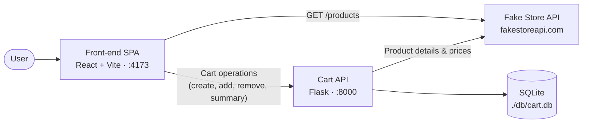

# Software Architecture MVP — Front-end Application

Online shopping single-page application developed for the Software Architecture
post-graduation course (PUC). It renders the store catalog and manages the shopping
cart, fetching product data directly from the external
[Fake Store API](https://fakestoreapi.com/) and delegating cart operations to the
[back-end cart API](https://github.com/ommeirelles/puc-arq-soft-cart).

## Stack

- **React 19** + **TypeScript** + **Vite 6**
- **Tailwind CSS 4** + **daisyUI** for styling
- **Zod** for runtime response validation

## Architecture Overview

This app is the front-end of a microservice-based system. It communicates with the
product service (Fake Store API) for catalog data and with the cart service (the
Flask back-end) for everything cart-related.

```mermaid
flowchart LR
    User([User]) --> FE["Front-end SPA<br/>React + Vite · :4173"]
    FE -->|"GET /products"| FSA["Fake Store API<br/>fakestoreapi.com"]
    FE -->|"Cart operations<br/>(create, add, remove, summary)"| BE["Cart API<br/>Flask · :8000"]
    BE -->|"Product details & prices"| FSA
    BE --> DB[("SQLite<br/>./db/cart.db")]
```

Key implementation points:

- The active cart is **session-less**: its GUID is created by the back-end and
  persisted in `localStorage` under the key `cart_guid`.
- Service layer in `src/services/`:
  - `api.ts` — abstract HTTP client (`get`/`post`/`put`/`patch`/`delete`) with
    optional Zod response validation.
  - `product.ts` — `ProductService`, a singleton that fetches products from the
    Fake Store API and caches them in memory by ID.
  - `cart.ts` — `CartService`, a singleton that creates/retrieves the cart,
    fetches the cart summary, and adds/removes items through the back-end API.
- Shared types and Zod schemas live in `src/types.ts`.

## Environment Variables

Configuration is done through a `.env` file — copy `.env.example` to `.env` and
adjust the values if needed:

| Variable                   | Default                     | Purpose                     |
| -------------------------- | --------------------------- | --------------------------- |
| `VITE_FAKE_STORE_API_URL`  | `https://fakestoreapi.com`  | Product catalog source      |
| `VITE_CART_API_URL`        | `http://localhost:8000`     | Back-end cart API base URL  |

## Running

### Docker

It's possible to run the *vite preview* using make (`make run`) or the
*vite development* server (`make dev`). Development serves the application with
each change made (via `docker compose --watch`), while preview uses a production
build that needs to be rebuilt on each new change applied.

*It's also possible to run without make:*

- **Vite Preview**
  - `docker build -t puc-arq-soft-front .`
  - `docker run --rm -p 4173:4173 puc-arq-soft-front`
  - The container exposes port **4173** for preview.
- **Vite Development**
  - `docker compose up --build --watch`
  - The container exposes port **4173** for development work.

> Docker is used through the Podman compatibility layer, with Compose enabled.

### Locally

Prerequisites:

- Node.js (LTS recommended — 22.x as of today)
- npm or yarn package manager

Steps:

1. Clone the repository
2. Run `npm install` (or `yarn install`) to install dependencies
3. Run `npm run dev` for the development server, or `npm run preview` to preview
   the production build

### npm Scripts

| Script            | Description                                  |
| ----------------- | -------------------------------------------- |
| `npm run dev`     | Start the Vite development server            |
| `npm run build`   | Type-check (`tsc -b`) and build for production |
| `npm run preview` | Preview the production build                 |
| `npm run lint`    | Run ESLint                                   |
